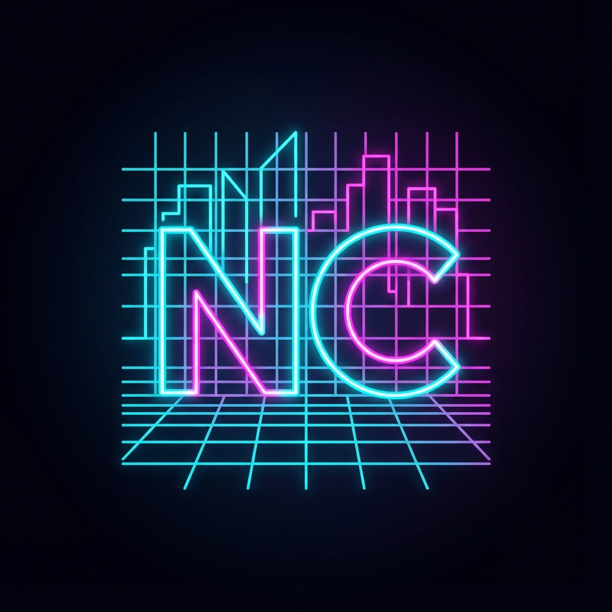
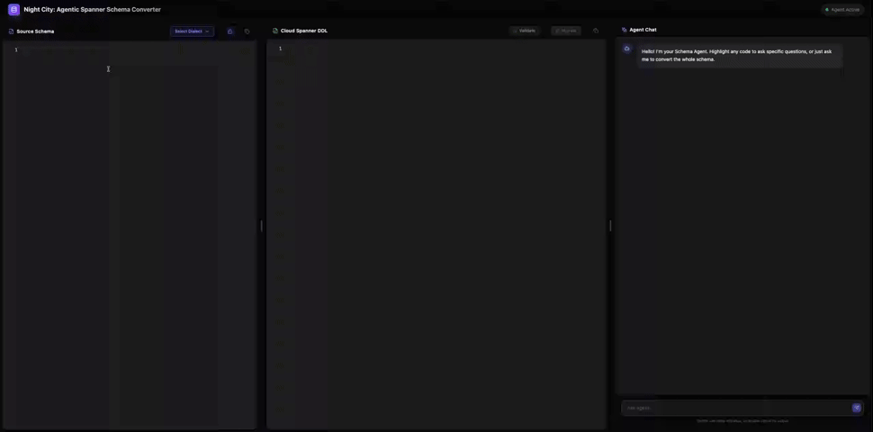

#  Night City: Agentic Spanner Schema Converter

**Night City** is an intelligent, human-in-the-loop schema conversion tool designed to modernize SQL schemas for Google Cloud Spanner. It combines a powerful LLM-based agent with a developer-focused UI to make schema migration interactive and seamless.



## 🚀 Key Features

- **Agentic Conversion**: An AI agent that doesn't just translate, but *understands* your schema.
- **IDE-like Experience**: Dual-pane editors allow you to review source and output, with an integrated **Diff View** for reviewing agent-proposed fixes.
- **Analyze & Fix Loop**: LLMs work best on feedback (from both humans and compilers!). Validate -> Repair flow allows you to review and accept/reject agent-proposed fixes to iteratively reach to a syntactly correct schema when the model gets it wrong in the first attempt. If validation fails, the agent analyzes the error and proposes specific fixes you can review and accept/reject in a IDE-like, diff-based editor
- **Direct Migration**: One-click deployment of your converted schema to a new Cloud Spanner database directly from the UI.
- **Agent Chat & Schema Refinement**: Ask questions or request schema changes (e.g., "Rename `id` to `user_id`"). The agent proposes changes via a "Review" button, letting you visualize diffs before accepting.

## ✅ Supported Dialects

Night City currently supports schema conversion from the following sources:
- **PostgreSQL**
- **MySQL**
- **Oracle**
- **SQL Server**
- **Cassandra**

## 🏗️ Architecture

The project consists of two main components:

1.  **Backend (`schema-agent-backend`)**: A FastAPI Python service that hosts the AI agent (using Google Gemini models). It includes specialized tools for **Schema Verification**, **Error Analysis**, and **Spanner Migration**.
2.  **Frontend (`schema-agent-ui`)**: A text-based, dark-mode React application providing the conversion interface.

### 🧠 Agentic Architecture

The core of Night City is a sophisticated AI pipeline that goes beyond simple translation:

#### 1. Contextual Augmentation (RAG)
Before the agent sees your schema, a **Context Manager** analyzes the Source DDL to inject relevant knowledge:
- **DDL Hints**: Scans for specific SQL keywords (e.g., `AUTO_INCREMENT`, `FOREIGN KEY`) and injects the exact Spanner DDL syntax rules for those features.
- **Feature Hints**: Detects patterns dependent on Spanner topology (e.g., identifying parent-child relationships for `INTERLEAVE IN PARENT`).
- **Mapping Rules**: Enforces deterministic data type conversions (e.g., PostgreSQL `JSONB` → Spanner `JSON`) based on the selected dialect.

#### 2. Chain of Thought (CoT) Reasoning
The agent is prompted to follow a rigid chain-of-thought workflow to break down the source schema before conversion:
1.  **Analyze**: Parse the source schema and identify constraints.
2.  **Plan**: Propose Spanner-specific optimizations (Interleaving, Sharding keys).
3.  **Generate**: Output clean, valid DDL.

#### 3. Human-in-the-loop Validation
- **Validation**: Users can instantly validate the generated DDL against a real Spanner instance.
- **Self-Correction**: If validation fails, the error is fed back to the agent ("Analyze & Fix"), which decompiles the error and attempts a targeted fix.

## 🛠️ Setup & Installation

### Prerequisites
- Python 3.10+
- Node.js 16+
- Google Cloud Project with Spanner API enabled (for verification)
- [Gemini API Key](https://ai.google.dev/gemini-api/docs/api-key)
- Docker (optional, for containerized run)

### 1. Environment Configuration

Create a `.env` file in the root directory (or ensure these variables are set in your environment/Cloud Run configuration). **These are mandatory for the application to start.**

```env
# Google Cloud Configuration
SPANNER_PROJECT_ID="your-project-id"
SPANNER_INSTANCE_ID="your-instance-id"

# Model Configuration
GEMINI_API_KEY="your-gemini-api-key"
# Optional: Defaults to gemini-3-pro-preview
GEMINI_MODEL="gemini-3-pro-preview"
```

### 2. Running Locally (Development)

Run backend and frontend separately for hot-reloading development.

#### Backend
```bash
cd schema-agent-backend
python -m venv venv
source venv/bin/activate
pip install -r requirements.txt
uvicorn main:app --reload --port 8001
```

#### Frontend
```bash
cd schema-agent-ui
npm install
npm run dev
```

### 3. Running Locally (Docker)

You can build and run the entire application as a single container.

```bash
# Build the image
docker build -t night-city .

# Run the container (passing env vars from your .env file)
docker run --env-file .env -p 8080:8080 night-city
```
The app will be available at `http://localhost:8080`.

### 4. Deploying to Google Cloud Run

Night City is optimized for Cloud Run. Specify your environment variables during deployment.

```bash
# Set your project
gcloud config set project YOUR_PROJECT_ID

# Deploy
gcloud run deploy night-city \
  --source . \
  --region us-central1 \
  --allow-unauthenticated \
  --min-instances 1 \
  --timeout 1200 \
  --cpu 2 \
  --memory 1Gi \
  --set-env-vars="GEMINI_API_KEY=your-key,SPANNER_PROJECT_ID=your-project,SPANNER_INSTANCE_ID=your-instance,GEMINI_MODEL=gemini-3-pro-preview"
```
Once deployed, click the generated URL to start using Night City.

## 💡 Usage Guide

1.  **Paste Schema**: Paste your MySQL/PostgreSQL schema into the left panel.
2.  **Select Dialect**: Choose the source dialect.
3.  **Convert**: Click the "Convert" button.
    - *Tip*: You can manually validate the schema after conversion.
5.  **Refine**:
    - Highlight code to ask the agent specific questions.
    - Chat with the agent to request changes (e.g., "Add a `shard_id` column").
    - Click "Apply Fix" or "Review Fix" when the agent proposes code changes.
6.  **Migrate**: 
    - Once satisfied, click "Migrate" to deploy the schema to a new Google Cloud Spanner database.

## 🤝 Contributing
We welcome contributions! Please follow the `standard` code style and ensured all new features have appropriate tests.
