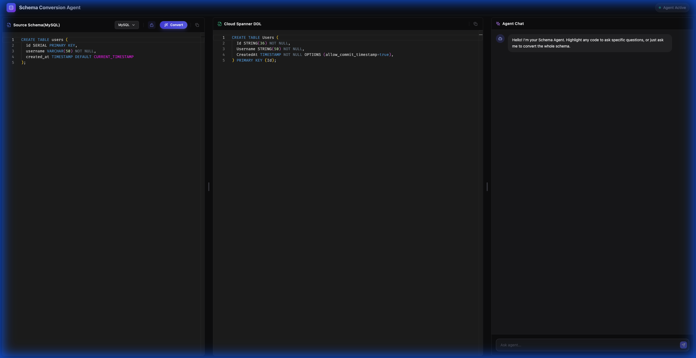
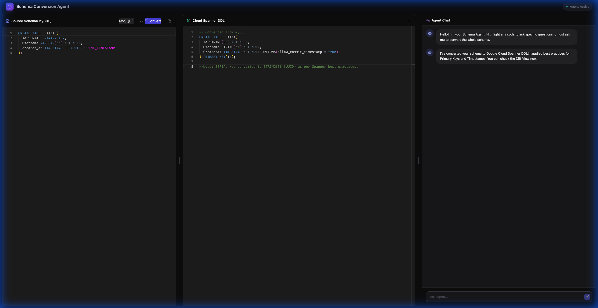
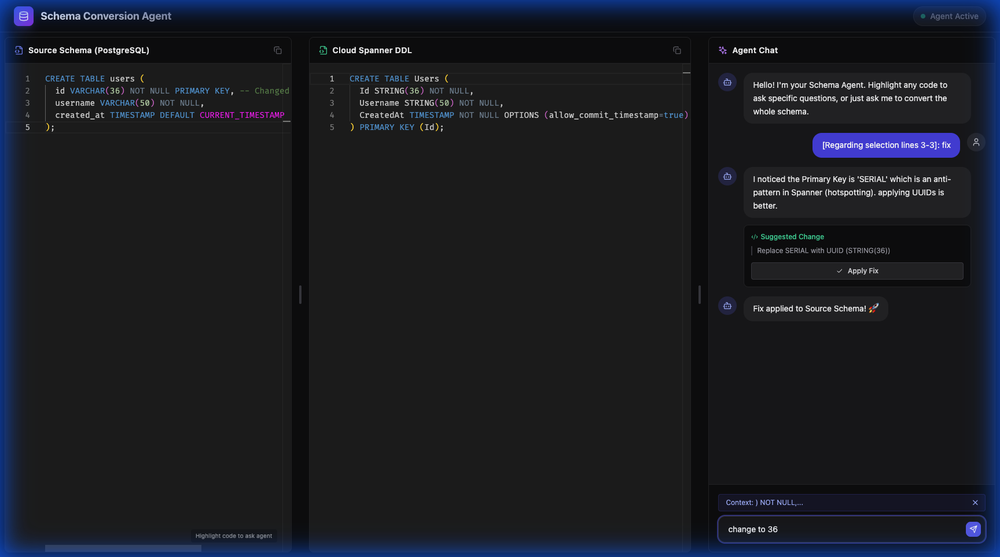
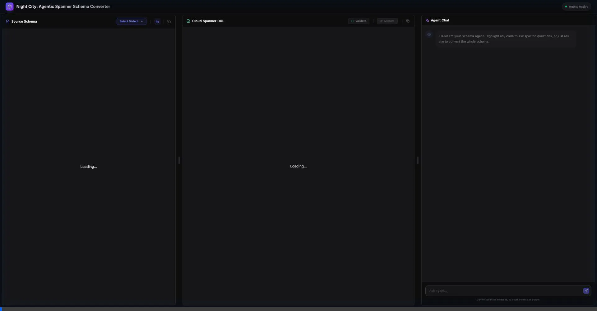

# Night City: Spanner schema converter

A slick, dark-mode "pair programming" interface for converting SQL schemas to Cloud Spanner.

## Features

### 1. Modern Tri-Panel Layout
- **Source Editor (Left)**: Monaco Editor for PostgreSQL/MySQL input.
- **Output/Diff View (Middle)**: Read-only view of the converted Spanner DDL.
- **Agent Chat (Right)**: Context-aware AI assistant.
- **Resizable Panels**: Smooth dragging between sections.

### 2. Context-Aware Interactions
- **Dual-Panel Selection**: Highlight code in **either** Source or Output editors to ask context-aware questions.
- **Floating Hints**: "Highlight code to ask agent" appears on hover in the interactive Spanner editor.

### 3. Auto-Mode (Multi-Turn Self-Correction)
- **Auto Toggle**: Enable "Auto mode" to let the agent autonomously iterate on the schema.
- **Self-Healing Loop**: The agent generates DDL, verifies it against Spanner, analyzes any errors, and applies fixes automatically.
- **Guaranteed Validity**: When the loop finishes, you get a schema that is **proven valid** against a live database.
- **Interactive Chat**: The agent analyzes your request (detects "fix" or "pk") and uses **Markdown** for rich text responses.
- **Diff View Review**: When the agent proposes complex fixes (or analyzes a validation error), you can review changes in a dedicated **Diff View** (green/red highlights).
- **Accept/Reject**: Seamlessly accept or reject proposed changes with one click.

### 4. Chat-Driven Schema Refinement
- **Natural Language Editing**: Simply tell the agent to "Rename column `x` to `y`" or "Change logic to use UUIDs".
- **Visual Confirmation**: The agent proposes a fix with a **"Review Changes"** button.
- **Diff View**: Verifying the change in a visual diff editor before applying it to your schema.

### 5. Real-time Verification & Migration
- **On-Demand Verification**: Manually validate the DDL against a real Spanner instance to catch complex issues.
- **Direct Migration**: Successfully validated schemas can be deployed to a new Spanner database via the "Migrate" button.
- **Feedback**: Provides a slick loading overlay with status updates during the verification process.

## Visuals

### Editor Workflow
1. **Source Dialect**: Select your SQL dialect (MySQL, Postgres, Oracle) from the slick dropdown.
2. **Locked by Default**: Editor starts locked. Click the lock icon to edit/paste.
3. **Smart Conversion**: The "Convert" button stays disabled until you select a dialect.



### Conversion Result
Once a dialect is chosen, click "Convert" to generate the Spanner DDL.



### Auto-Mode Logic
Enable **Auto Mode** to let the agent self-correct errors in a loop.
1.  **Generate**: Agent drafts schema.
2.  **Verify**: Checks against Spanner.
3.  **Fix**: If error, agent thinks and repairs (visible in real-time logs).
4.  **Success**: Loop completes only when schema is valid.

### Apply Fix Flow
1. **Selection**: User highlights code.
2. **Chat**: User asks to "fix".
3. **Result**: Agent suggests correction -> User Applies.



### Chat-Driven Schema Refinement
Ask the agent to make changes naturally, and review the proposed diffs.



## How to Run

```bash
npm install
npm run dev
```
Open [http://localhost:5174](http://localhost:5174).

### Sample MySQL schema 

```sql
CREATE TABLE users (
  id SERIAL PRIMARY KEY,
  username VARCHAR(50) NOT NULL,
  created_at TIMESTAMP DEFAULT CURRENT_TIMESTAMP
);
```